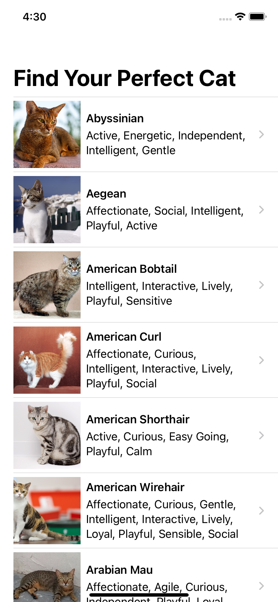

# CatAPISwiftUI
demo: REST API with SwiftUI

The example API is the cat API.
https://thecatapi.com/

You can watch me develope this code on my Youtube channel

Part 1: working with the Web, HTTP, JSON, and REST APIs https://youtu.be/ggEcSzPbVr4

Part 2: Parsing JSON https://youtu.be/6yelg66Z0BQ

Part 3:  SwiftUI Tutorial https://youtu.be/ZHK5TwKwcE4

 
  
   
   
  
